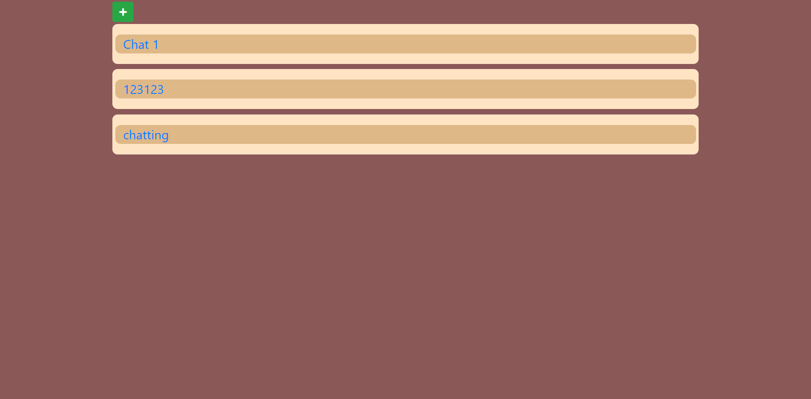
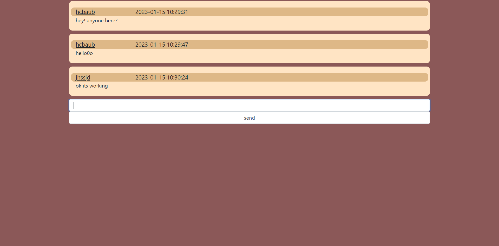
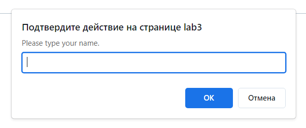
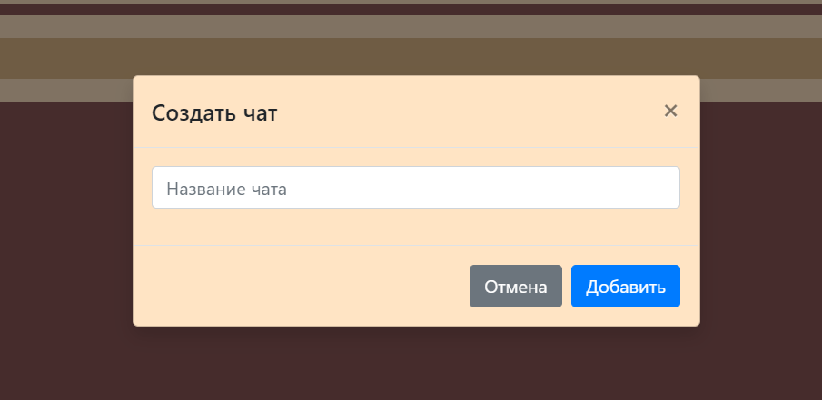
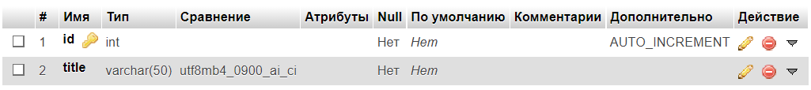
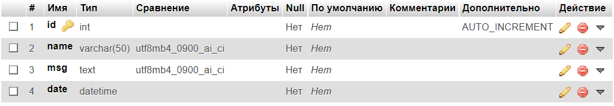

# Изучение технологии AJAX

## Цель работы:
Разработать и реализовать анонимный чат с возможностью создания каналов.

## Задание:
- подключение к каналу / создание нового
- сообщения доставляются без обновления страницы

## Пользовательский интерфейс

Страница с чатами


Страница какого-нибудь чата


Окошко ввода никнейма


Окошко добавления чата



#### API сервера и хореография
Сервер использует HTTP POST и GET запросы.

**Функция добавления сообщений:**
с помощью fetch() отправляется POST запрос с такими данными как: дата, никнейм и текст сообщения. 

**Функция добавления чатов:**
при нажатии на плюсик на главной странице появляется всплывающее окно, где пользователь может ввести название будущего чата. 


#### Пользовательский сценарий работы
При входе на страницу пользователь видит ленту комментариев и кнопку (плюсик) для добавления комментария.


## Структура базы данных
- БД со всеми чатами

  - **id** : INT, PRIMARY KEY, AUTO_INCREMENT
    (уникальный идентификатор чата)
  - **title**: VARCHAR(50)
    (название чата)
  
- БД для каждого чата

  - **id** : INT, PRIMARY KEY, AUTO_INCREMENT
    (уникальный идентификатор чата)
  - **name**: VARCHAR(50)
    (никнейм)
  - **msg**: TEXT
    (текст сообщения)
  - **date**: DATETIME
    (дата и время сообщения)


## Алгоритмы

- **Функция добавления сообщений:**

C помощью fetch() отправляется POST запрос с такими данными как: дата, никнейм и текст сообщения.


- **Функция добавления чатов:**

При нажатии на плюсик на главной странице появляется всплывающее окно, где пользователь может ввести название будущего чата.


## Значимые фрагменты кода

#### Вывод всех чатов на главную страницу
```php
$q = $pdo->prepare("SELECT * FROM `chats`");
$q->execute();
$result = $q->fetchAll();
... ...
<?php foreach ($result as $value) { ?>
                <div class="card-body" style="background: bisque; border-radius: 10px; margin-bottom: 10px">
                    <div class="row" style="background: burlywood; border-radius: 10px; font-size: x-large">
                        <div class="col-sm-6"><a href="main.php?open=<?=$value['title'] ?> " class="link-primary" target="_blank"><?=$value['title']?></a></div>
                        <?php require 'modal.php'; ?>
                    </div>
                </div>
                <?php } ?>
```
###  Реализация добавления сообщения
```javascript
<script>
    let sendbtn = document.getElementById('submitbtn');
    sendbtn.addEventListener('click', () => {
        sendbtn.disabled = true;
        let message = document.getElementById('msg').value;
        let create_data = new FormData();
        create_data.append('msg', message);

        let chat_id = document.getElementById('id').value;
        create_data.append('id', chat_id);

        fetch('http://lab3/func.php', {method: 'POST', body: create_data})
            .then(resp => resp.text())
            .then(chat_id => {
                alert('Сообщение отправлено');

                document.getElementById('msg').value = ''; //красоты ради
                btn_create.removeAttribute('disabled'); //аналогично

                let row1 = document.createElement('div');
                row1.className = "row mt-2";
                insert.appendChild(row1);

                let col1 = document.createElement('div');
                col1.className = "col-10";
                col1.innerHTML = message;
                row1.appendChild(col1);
            })
            .catch(err => {console.log(err)});

    })
</script>
```
```php
... ...
if (isset($_POST['submit'])) {
    $ttl = $_GET['open'];
	$sql = ("INSERT INTO `$ttl` (`name`, `msg`, `date`) VALUES(?,?,?)");
	$query = $pdo->prepare($sql);
	$query->execute([$name, $msg, $date]);
    unset($_POST['submit']);
}
```
### Добавление нового чата
```php
if (isset($_POST['submitNewChat'])) {
    $con = mysqli_connect("127.0.0.1","root", "root", "chat");
    $title = $_POST['title'];
    $sql = "CREATE TABLE `$title` (`id` INT NOT NULL AUTO_INCREMENT , `name` VARCHAR(50) NOT NULL , `msg` TEXT NOT NULL , `date` DATETIME NOT NULL , PRIMARY KEY (`id`)) ENGINE = InnoDB";
    mysqli_query($con, $sql);

    $sql2 = "INSERT INTO `chats`(`title`) VALUES (?)";
    $query2 = $pdo->prepare($sql2);
    $query2->execute([$title]);
    header('Location: '. $_SERVER['HTTP_REFERER']);
}
```
### Всплывающее окно для ввода никнейма
```php
<?php
function  createConfirmationmbox($prompt_msg){
    echo ("<script type='text/javascript'> var answer = prompt('".$prompt_msg."'); </script>");;
    $answer = "<script type='text/javascript'> document.write(answer); </script>";
    return($answer);
}
$prompt_msg = "Please type your name.";
$name = createConfirmationmbox($prompt_msg);
$_POST['name'] = $name;
?>
```